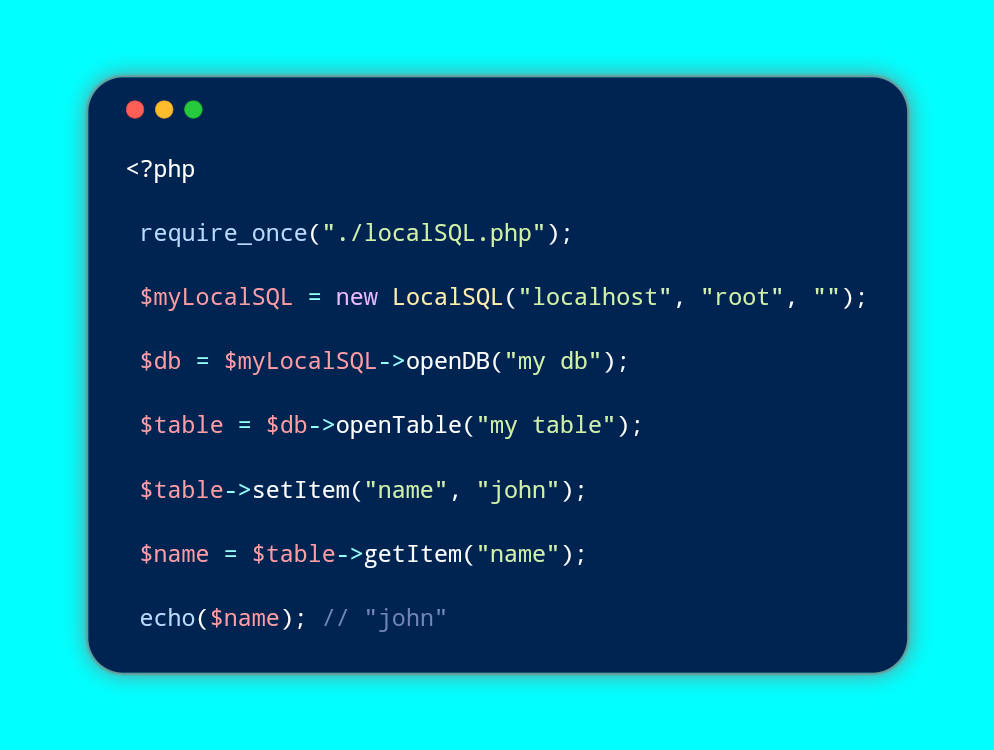

***don't forget to give this repo a star 🌟***
# LocalSQL 🤖


LocalSQL is a lightweight PHP framework designed to simplify database interactions with MySQL. It empowers PHP developers by reducing the need to struggle with complex MySQL syntax and offers a more secure coding experience 👷.

**NOTE**: LocalSQL also provides protection against SQL injections 💉 👎 💪.

# Installation 💻
To get started with LocalSQL, simply download the [localSQL.php](localSQL.php) file and import it into your project.

```php
<?php
require_once("./localSQL.php");
```

# Using LocalSQL 📝
LocalSQL is designed to be straightforward, with self-explanatory naming conventions 😎.

```php
<?php
$localSQL = new LocalSQL("DB_HOST", "DB_USER", "DB_PASSWORD");
```

## LocalSQL Class
The `LocalSQL` class is the core part of the LocalSQL framework, taking three parameters 💣:

- DB_HOST: Database host name
- DB_USER: Database user name
- DB_PASSWORD: Database user password

Here are the methods available when using the `LocalSQL` class 🎆:

### **openDB**
This method creates a database if the given name doesn't exist or opens it if it does.

```php
<?php
$database = $localSQL->openDB("DB_name");
```

This method returns an instance of the [Table class](#table-class) 😉.

### **removeDB**
Use this method to remove a specified database.

```php
<?php
$result = $localSQL->removeDB("DB_name");
```

It returns TRUE or FALSE 😇.

### **hasDB**
Check if a specific database exists using this method.

```php
<?php
$result = $localSQL->hasDB("DB_name");
```

This method returns TRUE or FALSE 😰.

### **keys**
Retrieve a list of all available database names using this method.

```php
<?php
$result = $localSQL->keys();
```

It returns an array list 😉.

### **removeAllDB**
Delete all available databases using this method.

```php
<?php
$result = $localSQL->removeAllDB();
```

It returns TRUE or FALSE 😇.

### **localStorage**
Automatically open a [database](#opendb) named "localStorage" and a [table](#opentable) with the specified name.

```php
<?php
$table = $localSQL->localStorage("TABLE_name");
```

This method returns an instance of the Item class 😇.

## Table Class
Here are the methods available when using the [openDB](#opendb) method:

### **openTable**
This method creates a database table if the given name doesn't exist or opens it if it does.

```php
<?php
$table = $database->openTable("TABLE_name");
```

It returns an instance of the [Item class](#item-class) 😉.

### **removeTable**
Remove a specified table using this method.

```php
<?php
$result = $database->removeTable("TABLE_name");
```

This method returns TRUE or FALSE 😇.

### **hasTable**
Check if a specific table exists with this method.

```php
<?php
$result = $database->hasTable("TABLE_name");
```

It returns TRUE or FALSE 😯.

### **keys**
Retrieve a list of all available table names using this method.

```php
<?php
$result = $database->keys();
```

It returns an array list 😱.

### **removeAllTable**
Delete all available tables from the database using this method.

```php
<?php
$result = $database->removeAllTable();
```

It returns TRUE or FALSE 😇.

## Item Class
When using the [openTable](#opentable) method, you can access the following methods:

### **setItem**
Create or set an item inside the database table using this method.

```php
<?php
$result = $table->setItem("name", "value");
```

It returns TRUE or FALSE 😋.

### **getItem**
Retrieve an item from the database table using this method.

```php
<?php
$item = $table->getItem("name");
```

This method returns the item value 😊.

### **hasItem**
Check if a specific item exists in the table with this method.

```php
<?php
$result = $table->hasItem("name");
```

It returns TRUE or FALSE 😻.

### **keys**
Retrieve a list of all item names available in the table.

```php
<?php
$result = $table->key();
```

It returns an array list 😉.

### **removeItem**
Remove a specific item from the table using this method.

```php
<?php
$result = $table->removeItem("name");
```

It returns TRUE or FALSE 👼.

### **removeAllItem**
Remove all available items from the table using this method.

```php
<?php
$result = $table->removeAllItem();
```

This method returns TRUE or FALSE 👻.

### **getAllItem**
Retrieve all items from the database table using this method.

```php
<?php
$items = $table->getAllItem();
```

This method returns an array object 🍻.

# PHP Version Support 🌠
So far, this framework works on PHP version `7.1.33`, and previous PHP versions are yet to be tested 🎠.

# Conclusion 📜

LocalSQL is a PHP framework that simplifies the process of working with MySQL databases. By providing an intuitive and secure interface, it allows PHP developers to focus on their coding, rather than struggling with complex SQL syntax and worrying about security vulnerabilities.

With LocalSQL, you can easily create and manage databases, tables, and items with straightforward methods. It's a lightweight and user-friendly solution for database interaction, designed to make your development process smoother and more efficient.

We hope you find LocalSQL useful and that it enhances your PHP development experience. If you have any questions, feedback, or would like to collaborate, please don't hesitate to reach out to us on [Facebook📱](https://facebook.com/owens94819.me).

Kudos for choosing LocalSQL, and happy coding! 👷
